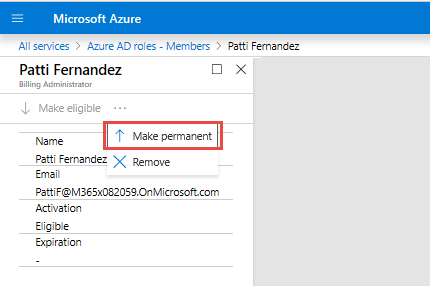
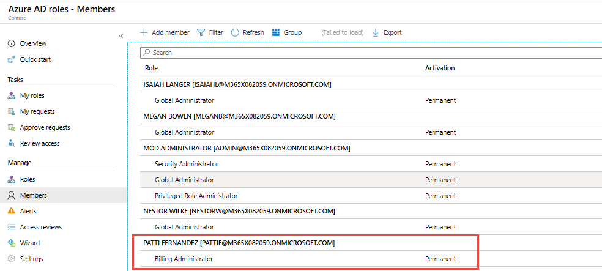
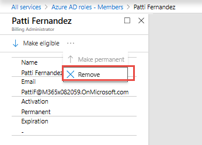

# Module 1 - Lab 2 - Exercise 2 - Assign Directory Roles

### Task 1:  Make a user eligible for a role

In the following task you will make  a user eligible for an Azure AD directory role.

1.  Sign in to Azure portal

1.  In the Azure Portal, click **All services** and search for and select **Azure AD Privileged Identity Management**.

     

1.  Select **Azure AD Roles**. If this is option is still greyed you may need to refresh your browser.

     
 
1.  Click **Sign up PIM for Azure AD Roles**.

     

1.  Click **Sign Up** and click **Yes**.

     

1.  When processing is complete **Refresh the Broswer**.

1.  Click **Roles**.

     

1.  Click **Add member** to open Add managed members.

     

1.  Click **Select a role**, and click **Billing Administrator** and then click  **Select**.

     

1.  Click **Select members**, select **Patti Fernandez** and then click **Select**.

     

1.  In Add managed members, click **OK** to add the user to the role.

1.  Review the added member

     

1.  When the role is assigned, the user you selected will appear in the members list as **Eligible** for the role.

### Task 2: Make a role assignment permanent

By default, new users are only eligible for a directory role. Follow these steps if you want to make a role assignment permanent.

1.  In the Azure Portal, click **All services** and search for and select **Azure AD Privileged Identity Management**.

     

1.  Click **Azure AD roles**.

     

1.  Click **Members**.

     

1.  Click the **Eligible** role that you want to make permanent.

     
 
1.  Click **More** and then click **Make permanent**.

     
 

**Results**: The role is now listed as **permanent** for Patti Fernandez.

### Task 3: Remove a user from a role

You can remove users from role assignments, but make sure there is always at least one user who is a permanent Global Administrator.

1.  In the Azure Portal, click **All services** and search for and select **Azure AD Privileged Identity Management**.

     

1.  Click **Azure AD roles**.

     

1.  Click **Members**.

     

1.  Click a role assignment you want to remove in this case Patti Fernandez as Billing Administrator.

     
 
1.  Click **More** and then click **Remove**.

     
 
1.  In the message that asks you to confirm, click **Yes**. The role assignment will be removed.

# Continue to exercise 3

