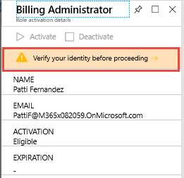
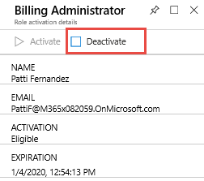

# Module 1 - Lab 2 - Exercise 3 - Activate and Deactivate PIM Roles

### Task 1: Activate a role

When you need to take on an Azure AD directory role, you can request activation by using the **My roles** navigation option in PIM.

1.  In the Azure Portal, click **All services** and search for and select **Azure AD Privileged Identity Management**.

     

1.  Click **Azure AD roles**.

     
 
1.  Click **Quick Start** and click **Assign eligibility**.

     

1.  Click **Billing Administrator** and add Patti Fernandez back into the **Billing Administrators** role.

1.  Open an **In Private** browsing session and navigate to **`https://portal.azure.com`** and login as **Patti** using her UPN. example PattiF@<YourTenant>.onmicrosoft.com with the password given by your lab hoster (hint: the password is likely the same as the MOD Administrator password).  

1.  In the Azure Portal, click **All services** and search for and select **Azure AD Privileged Identity Management**.

     

1.  Click **Azure AD roles**.

     

1.  Click **Quick start** and click **Activate your role**.

     

1.  On the Billing Administrator role, scroll to the right and click **Activate**.

     

1.  Click **Verify your identity before proceeding**. You only have to authenticate once per session. Run through the wizard to authenticate Patti.

     
 
1.  Once returned to the Azure Portal, click **All services** and search for and select **Azure AD Privileged Identity Management**.

     

1.  Select **Azure AD Roles** then click click **Activate your role** on the Quick start blade.

1.  On the Billing Administrator role, scroll to the right and click **Activate**.

     

1.  Click **Activate**.

1.  Enter an activation reason and click **Activate**

     

By default, roles do not require approval unless configured explicitly in settings. 

 If the role does not require approval, it is activated and added to the list of active roles. If you want to use the role right away, follow the steps in the next section.

 If the role requires approval to activate, a notification will appear in the upper right corner of your browser informing you the request is pending approval.

### Task 2: Use a role immediately after activation

When you activate a role in PIM, it can take up to 10 minutes before you can access the desired administrative portal or perform functions within a specific administrative workload. To force an update of your permissions, use the **Application access** page as described in the following steps.

1.  Click **Sign Out**.

     

1.  Log back in as Patti.

### Task 3: View the status of your requests

You can view the status of your pending requests to activate.

1.  Still signed in as **Patti**, in the Azure Portal, click **All services** and search for and select **Azure AD Privileged Identity Management**.

     

1.  Click **Azure AD Roles**.

1.  Click **My requests** to see a list of your requests.

     

### Task 4: Deactivate a role

Once a role has been activated, it automatically deactivates when its time limit (eligible duration) is reached.

If you complete your administrator tasks early, you can also deactivate a role manually in Azure AD Privileged Identity Management.

1.  Still signed in as **Patti**, open Azure AD Privileged Identity Management.

1.  Click **Azure AD roles**.

1.  Click **My roles**.

     

1.  Click **Active roles** to see your list of active roles.

     

1.  Find the role you're done using and then click **Deactivate**.

     

1.  Click **Deactivate** again.

     

1.  Click **Yes** to confirm.

### Task 5: Cancel a pending request

If you do not require activation of a role that requires approval, you can cancel a pending request at any time.

1.  **Open Azure AD Privileged Identity Management**.

1.  Click **Azure AD roles**.

1.  Click **My requests**.

1.  For the role that you want to cancel, click the **Cancel** button.

**Note**: The cancel button in this task is greyed out as the request was approved.

When you click Cancel, the request will be cancelled. To activate the role again, you will have to submit a new request for activation.

# Continue to exercise 4
