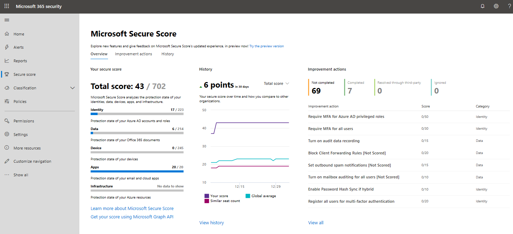
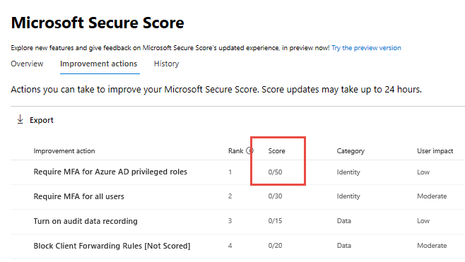

# Module 1: Lab 2 - Exercise 1 - Improve your secure score in Microsoft 365 Security Center

You now have a Global Admin account set up for Holly Dickson, and you&#39;re signed into Microsoft 365 as Holly.

With so many services offering security benefits, it is often difficult for Holly to know what steps to take first. The Microsoft secure score reviews her security recommendations and prioritizes them, so she can know which recommendations to prioritize. In this exercise Holly is going to view her organizations Microsoft secure score and use the portal to take a recommended action to improve the score.

**Secure score calculation**

Security Center mimics the work of a security analyst, reviewing your security recommendations, and applying advanced algorithms to determine how crucial each recommendation is.

Microsoft Security center constantly reviews active recommendations and calculates your secure score based on them, the score of a recommendation is derived from its severity and security best practices that will affect your workload security the most.

### Task 1: View the secure score in the Microsoft 365 Security Portal.

1.  Go to the Microsoft 365 security dashboard (https://security.microsoft.com) and login with Holly's global admin credentials, click **Secure score** on the dashboard.
2.  At the top you can see Secure score highlights:

       - The **Total score** represents the score per policies, per selected subscription
       - Secure score by category shows you which resources need the most attention
 
       

    
      **Note**: The sum of the secure score of each subscription does not equal       the overall secure score. The secure score is a calculation based on the      ratio between your healthy resources and your total resources per     recommendation, not a sum of secure scores across your subscriptions. 

3.  Select **Improvement Actions** to see the actions you can take to improve the secure score for that subscription.

4.  In the list of actions, you can see that for each action there is a column that represents the **Score**. This number represents how much your overall secure score will improve if you follow the recommendations. For example, in the screen below, if you **Require MFA for Azure AD privileged roles**, your secure score will increase by 50 points.

       

### Task 2: View the Microsoft Secure Score History.

In addition, you can view the history of your secure score, click the **History** option.  

You can customize the day range for the view and focus on specific secure score categories.  This will give you a sense of how your security posture has changed over time.

The Secure Score History view also lists specific actions you have taken and the impact it has had on your score.

### Task 3: Improve your Secure Score

1.  In the Improvement actions view double-click **Enable self-service password reset**. More information about this security action appears. Notice it includes specific instructions to take this action.

2.  Click the **View settings** button.  A new browser tab should open directly to the **Password reset - Properties** blade in Azure portal.
  
3.  Under **Self service password reset enabled** click All.

4.  Click **Save**.
5.  In the Manage area click **Registration**.
6.  Make sure "Require users to register when signing in?" is marked **Yes**. 
7.  Change the Number of days before users are asked to re-confirm their authentication information to **90**.
8.  Click **Save**.

**Note:**  Score updates may take 24 hours to appear in your Microsoft Secure Score.  Also, partial score may be given depending on the action.  For example, this tenant includes 10 users, if just two of the users were enabled for Self service password reset 1/5 points would be awarded for this action.

**Results**: In this lab, you learned how to improve your secure score in the Microsoft Security Center.

# End of Lab 