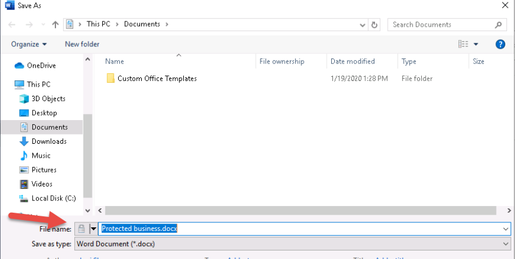

# Module 1 - Lab 2 - Exercise 2 - Implement Windows Information Protection  

Now that you have implemented Azure Information Protection as part of your pilot project at Adatum, you’re now ready to implement Windows Information Protection. In this exercise, in your role as Holly Dickson, you will create a WIP policy (Client App protection policy for Windows) that is applied to any member of the WIP Users group who has an MDM enrolled device in Intune.

### Task 1 - Create a Group for Compliance Testing

To test features in your Adatum pilot project, you will create a new mail-enabled security group and assign two users to the group – Joni Sherman and Lynne Robbins. These will be your two test users involved in the Windows Information Protection (WIP) pilot program. This group will then be used in the next task when you configure MDM auto-enrollment for new devices in your tenant. 

1. You should be logged into the LON-CL1 VM. You should still be logged into LON-CL1 as the **lon-cl1\admin** account, and you should be logged into Microsoft 365 as **Holly Dickson**. 

2. In **Microsoft Edge**, select the **Microsoft 365 admin center tab** or open a new tab and go to **https://admin.microsoft.com**.

3. the **Microsoft 365 admin center**, in the left navigation pane, select **Groups** and then select **Groups** below it.

4. Select **Add a group** to create a new group for compliance testing. 

5. In the **Add a group** window, enter the following information:

6. Fill all the fields to create the **WIP Users** group:

	- Type: **Mail-enabled security**

	- Name **WIP Users**

	- Group email address: Set to **wipusers** for the alias of the group email address.

	- Group email address domain: to the right of the group email address alias is the email address domain. **M365xZZZZZZ.onmicrosoft.com** (where ZZZZZZ is your unique tenant ID provided by your lab hosting provider) should be displayed here.

7. Select **Next**, and then select **Create Group**. Once the group is created select **Close**.

8. In the **Microsoft 365 admin center** tab, refresh the page to display the WIP users group in the list of Groups. You may have to wait a few minutes before you see the WIP users group.

9. Once **WIP Users** appears In the **Groups** window, select it.

10. In the **WIP Users** window, select the **Members** tab. 

11. In the **Members** tab, under the **Members** section, select **View and manage members**.

12. In the **View members** window, select **+Add members**. This displays the list of users.

13. In the list of users, select **Joni Sherman** and **Lynne Robbins**, then scroll to the bottom of the list and select **Save**, and then select **Close**.

	‎**Note:** It may take a few minutes for both Joni and Lynne to display in the list of users. Simply refresh the list until both users appear.

14. Close the **WIP users** window.

15. Leave your browser open to the Microsoft 365 admin center and proceed to the next task.

### Task 2 – Configure Windows Information Protection

In this task you will create a WIP policy and assign it to the WIP Users group that you just created. 

1. You should be logged into Client 1 VM (LON-CL1). You should still be logged into your Client 1 VM as the **lon-cl1\admin** account, and you should be logged into Microsoft 365 as **Holly Dickson.** 

2. In **Microsoft Edge**, if you have the Azure portal open in a tab, then select it now; otherwise, enter **https://portal.azure.com/** and, if necessary, sign in as **holly@M365xZZZZZZ.onmicrosoft.com.**

3. In the **Azure portal**, if a window displays indicating **You have free Azure Advisor recommendations**, then close the window now.

4. In the **Azure portal**, in the left navigation bar, select **All services.**

5. In the **All services** window, enter **client** in the **Search** box at the top of the window, and then in the right-hand pane, select **Client apps.**

6. In the **Client apps** window, in the middle pane under **Manage**, select **App protection policies**.

7. In the **Client apps – App protection policies** window, in the right pane, select **+Create policy** from the top menu bar.

8. In the **Create policy** window, select **Windows 10** enter the following information:

	- Name: **WIP Client Protection**

	- Description: leave blank

	- Enrollment state: **With enrollment**

	- Protected apps: select the **Next**, and in the **Targeted apps** window, select **+ Add** in the Protected Apps area. In the **Add apps** window, scroll to the bottom and select **Office-365-ProPlus-1810-Allowed.xml** (this file may be difficult to find in the list because the file name is cut off in the display) and then select **OK**. 

	- Exempt apps: leave blank as there are no exempt apps in this policy. On the **Targeted apps** tab, select **Next**.

	- Required settings: in the **Windows Information Protection mode** setting, select **Block**. In the **Corporate identity** field, verify that it says **M365xZZZZZZ.onmicrosoft.com** (where ZZZZZZ is your tenant ID provided by your lab hosting provider) and then select **OK.**

	- Advanced settings: do not change the default value

9. Select **Next** until you get to the **Review + Create** tab. Select **Create** on the bottom of the screen.

10. On the **Client apps - App protection policies** window, in the right pane, note the value of the **Deployed** column is **No** for the **WIP Client Protection** policy that you just created. You are now going to deploy this policy. Select the **WIP Client Protection** policy.

11. In the **Intune App Protection** window, in the middle pane under the **Manage** section, select **Properties**.

12. In the **Intune App Protection - Properties** window, in the right pane, under the **Assignments** section, select **Edit**.  

13. In the **Edit policy** window, select **+ Select groups to include**. Select the **WIP Users** group and then select **Select** at bottom of the screen.

14. In the menu bar at the top of the right-hand pane, select **Review + Save**. And then select **Save**.

15. In the navigation thread at the top of the window (above the **Intune App Protection - Properties** title), select **Client apps – App protection policies**. In the list of policies in the right pane, note the value of the **Deployed** column has now changed from **No** to **Yes** for the **WIP Client Protection** policy.

16. Leave your Client 1 VM and browser open for the next lab.

You have now created an **App protection policy** (which is a Windows Information Protection policy) that protects files in Office 365 ProPlus for users with enrolled devices in the **WIP Users** group.

### Task 3 – Use Windows Information Protection

In this task you will enroll the Client 2 VM (LON-CL2) to Azure AD and test the Windows Information Protection policy that you created in the prior task by creating a work document and then copy and pasting from it to a personal location. This will test the WIP protection feature that prevents copy and pasting between a protected Word document and an untrusted website in your Edge browser Since the WIP policy that you created was assigned to the WIP Users group, you must switch to the Client 2 VM and create the document while signed in as Joni, who is one of the members of the WIP Users group.

1. Switch to your Client 2 VM (LON-CL2) as the **lon-cl2\admin** account, and you should be logged into Microsoft 365 as **Joni Sherman**. 

2. In the **Search** box on the taskbar at the bottom of the window, type **Access work or school**. In the menu that appears, select **Access work or school**.

3. Below **Access work or school**, select **Connect**.

4. Enter **JoniS@M365xZZZZZZ.onmicrosoft.com** to the **Email address** field and select **Next**.

5. On the **Enter password** window, enter **Pa55w.rd** and select **Sign in**.

6. In the **You're all set!** screen click **Done**.

7. Under Related settings select **Enroll only in device management**

6. If a **More information required** window appears. Select **Next**.

7. Enter **JoniS@M365xZZZZZZ.onmicrosoft.com** to the **Email address** field and select **Next**.

8. In the Setting up your device screen select **Got it**.  You should see a "Connected to Contoso MDM" or similar connection.

12. Open **Microsoft Word**. 

13. Select **Blank document**.

14. If a **What’s New** window opens, close it.

15. In the document, type **Protected business content**.

16. Select **File** from the menu bar above the ribbon, select **Save As** on the left menu, and then select **Browse** from the **Save As** menu.

     

17. In the **File Explorer** window, you should see a **lock symbol** that appears to the left of the **File name** field. Next to this lock symbol is a drop-down arrow. Select this arrow, and in the menu that appears, select **Work (m365xZZZZZZ.onmicrosoft.com).**

18. Accept the default file name **Protected business content.docx**, change the file path to your **Documents** folder and select **Save**.

You have just enrolled the Client 2 VM to your tenant, so the Client app protection policy **WIP Client Protection** that you configured in the last task could be applied to protect the content of a Word document.

# End of Lab